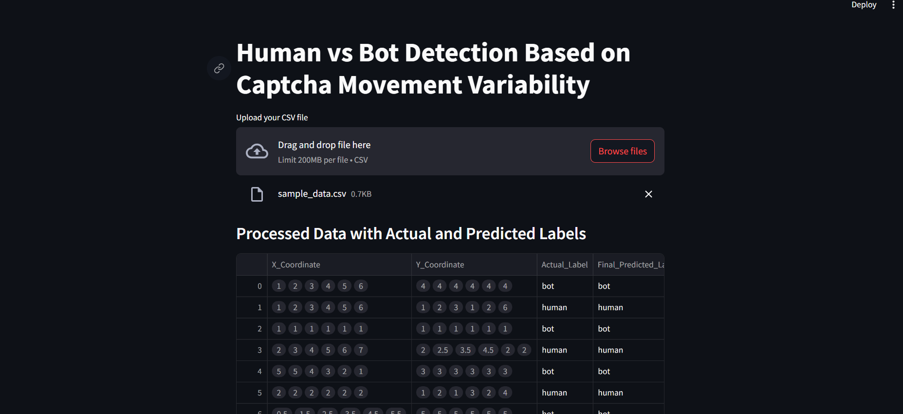
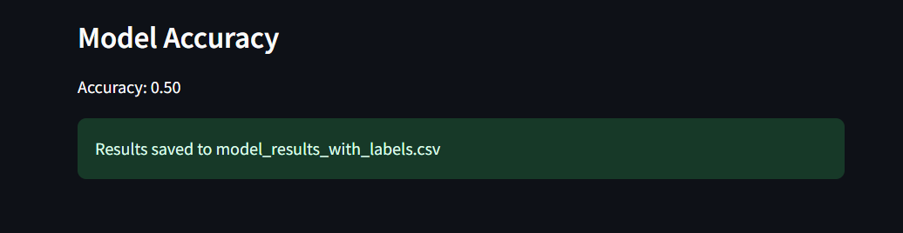

# Bot-Detection-Captcha

## Human vs Bot Detection Based on Captcha Movement Variability

This project aims to develop a robust system for detecting human and bot interactions based on the variability in movement patterns during a captcha challenge. By analyzing movement characteristics, we can distinguish between human users, who exhibit more varied and less predictable movement, and bots, which tend to have consistent and uniform patterns.



## Approach

The approach for detecting bots versus humans is based on analyzing movement data captured during captcha interactions. The key steps in the methodology include:

1. **Data Collection**: 
   - Movement data is collected, including X and Y coordinates that represent the user's interaction during the captcha challenge.

2. **Preprocessing**:
   - The raw movement data is cleaned and transformed into a format suitable for analysis, extracting key features that reflect user behavior.

3. **Feature Engineering**:
   - The following features are derived from the movement data:
     - **Mean Position**: Average X and Y coordinates.
     - **Standard Deviation**: Measures variability in movement.
     - **Movement Speed**: Captured by analyzing the differences in movement over time.
     - **Variability Metrics**: Such as counts of direction changes and constant movement detection.

4. **Model Training**:
   - A machine learning model (Random Forest Classifier) is trained using the engineered features and labeled data (human or bot).
   - The model is evaluated using accuracy metrics to determine its performance in distinguishing between human and bot interactions.

5. **Results**:
   - The model's predictions and actual labels are displayed, showing how well it can identify human versus bot behavior.



## Getting Started

To run the application:

1. Clone this repository.
2. Install the required libraries:
   ```bash
   pip install -r requirements.txt

3. Run the Streamlit application:
   ```bash
   streamlit run mode.py
